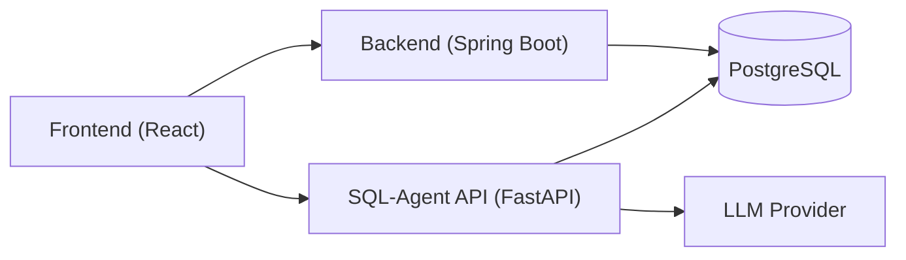
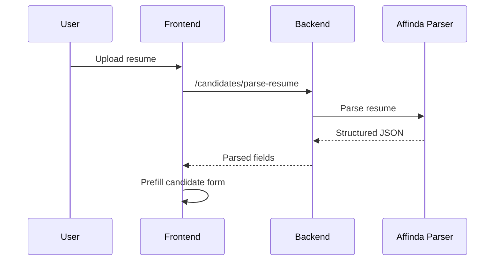
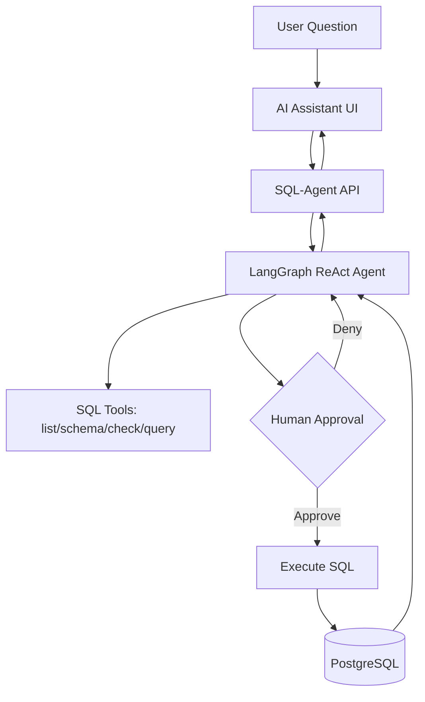

# Jolyne - AI-Powered HR Tooling

Jolyne is a full-stack HR tooling application that combines candidate management, AI resume parsing, and a human-in-the-loop SQL chatbot for safe analytics. It is designed to help HR teams and recruiters move faster while keeping data access transparent and auditable.

## Why this matters
- Centralize candidate intake, enrichment, and pipeline tracking.
- Extract structured data from resumes automatically.
- Ask natural language questions about candidate data with safety controls.

## Architecture (high level)

## AI features (recruiting intelligence)

### 1) Resume parsing pipeline
The resume parsing flow uses an LLM to transform noisy PDFs or text into structured candidate fields. The output is used to prefill candidate forms and drive smarter search.

Key files:
- [Frontend/src/components/AddCandidateModal/AddCandidateModal.js](Frontend/src/components/AddCandidateModal/AddCandidateModal.js): Uploads resumes, calls `/candidates/parse-resume`, maps parsed fields into the candidate form, and preserves user edits.
- [Backend/src/main/java/com/example/demo/controller/CandidateController.java](Backend/src/main/java/com/example/demo/controller/CandidateController.java): Exposes `/parse-resume` and `/upload-resume` endpoints used by the UI.

### 2) SQL AI agent with safety controls
The SQL Agent answers natural language questions about candidate data by generating SQL and asking for approval before execution. This keeps analytics powerful but safe.

Key files:
- [SQL-Agent/chat_api.py](SQL-Agent/chat_api.py): FastAPI server for chat sessions, pending tool approvals, caching, schema refresh, and message history.
- [SQL-Agent/langchain_setup.py](SQL-Agent/langchain_setup.py): Provider selection (Ollama/Groq/Gemini), SQL tools, ReAct agent prompt, and safety rules.
- [SQL-Agent/db_page.py](SQL-Agent/db_page.py): Creates the `candidates` table and seed data for development/demo use.
- [Frontend/src/components/AIAssistant/AIAssistant.jsx](Frontend/src/components/AIAssistant/AIAssistant.jsx): Chat UI with schema refresh, approval cards, message streaming, and history restore.
- [Frontend/src/api/chatbotApi.js](Frontend/src/api/chatbotApi.js): Frontend API client for chat, approval, history, and schema refresh.

## Chatbot behavior (detailed)
1. The UI creates or restores a chat session.
2. The SQL-Agent builds a query plan, then pauses before execution.
3. The UI displays the SQL and lets the user approve or deny.
4. On approval, the SQL is executed and results are formatted for chat.
5. History is stored and can be reloaded into the UI.

## Product features
- Candidate CRUD, search, and pipeline stage updates.
- Resume upload and parsing for structured candidate profiles.
- AI assistant for database questions with human approval.
- Schema refresh in the UI to keep tool context up to date.

## Project map (key files touched)

### Root
- [ENV_SETUP.md](ENV_SETUP.md): .env instructions and provider configuration.

### Backend (Spring Boot)
- [Backend/src/main/java/com/example/demo/HrmsApplication.java](Backend/src/main/java/com/example/demo/HrmsApplication.java): Application bootstrap.
- [Backend/src/main/java/com/example/demo/controller/CandidateController.java](Backend/src/main/java/com/example/demo/controller/CandidateController.java): Candidate endpoints, resume upload, and parsing proxy.

### Frontend (React)
- [Frontend/src/App.jsx](Frontend/src/App.jsx): Routes (including AI assistant entry point).
- [Frontend/src/index.jsx](Frontend/src/index.jsx): App bootstrapping.
- [Frontend/src/api/candidateApi.js](Frontend/src/api/candidateApi.js): Candidate API client.
- [Frontend/src/api/chatbotApi.js](Frontend/src/api/chatbotApi.js): Chatbot API client.
- [Frontend/src/components/AIAssistant/AIAssistant.jsx](Frontend/src/components/AIAssistant/AIAssistant.jsx): AI assistant UX and approvals.
- [Frontend/src/components/AIAssistant/AIAssistant.css](Frontend/src/components/AIAssistant/AIAssistant.css): AI assistant styling.
- [Frontend/src/components/AddCandidateModal/AddCandidateModal.js](Frontend/src/components/AddCandidateModal/AddCandidateModal.js): Resume parsing integration and candidate form.

### SQL-Agent (FastAPI + LangChain)
- [SQL-Agent/chat_api.py](SQL-Agent/chat_api.py): Chat server, approvals, cache, and schema monitoring.
- [SQL-Agent/langchain_setup.py](SQL-Agent/langchain_setup.py): Model/tool setup and safety prompts.
- [SQL-Agent/db_page.py](SQL-Agent/db_page.py): Candidate schema + seed data for testing.
- [SQL-Agent/Pdfparser.py](SQL-Agent/Pdfparser.py): LLM-based resume parsing + optional Chroma semantic search.
- [SQL-Agent/Blog.md](SQL-Agent/Blog.md): Architecture notes for the SQL agent design.
- [SQL-Agent/plan.md](SQL-Agent/plan.md): Reference plan for the SQL agent tutorial base.

## Environment setup
Use the guide in [ENV_SETUP.md](ENV_SETUP.md) to configure:
- Frontend base URLs for backend + SQL agent.
- Backend database + parsing credentials.
- SQL-Agent model provider and DB connection.

## Positioning
Jolyne is an HR tooling application that blends operational workflows (candidate intake, pipelines, resume management) with AI intelligence (resume parsing and natural language analytics). It is built for speed, transparency, and safety.
