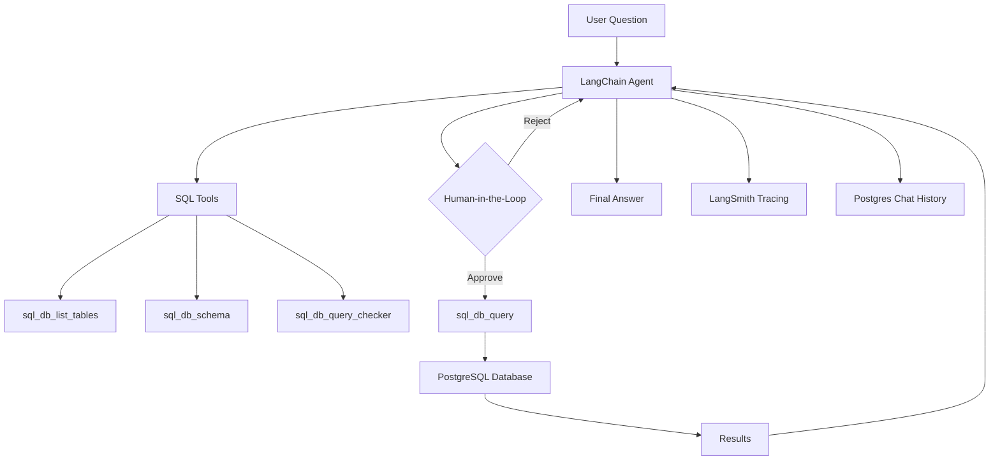

# Building a Human-in-the-Loop SQL Agent with LangChain

## What is LangChain?
LangChain is a framework that helps you build AI applications that can use tools and data. Instead of just asking a model a question, you can connect it to databases, APIs, and custom tools, then guide it with structured prompts and safety rules. This makes the AI more reliable and useful for real tasks.

## What I built
I built a SQL agent that can query a PostgreSQL database and answer questions about candidate data. The system is designed in small, maintainable pieces:

- A database setup script that creates the schema and loads dummy candidate data.
- A LangChain agent that can list tables, inspect schema, validate queries, and run SQL.
- Human-in-the-loop review so I can approve SQL execution before it runs.
- Postgres-backed chat history so conversations can be stored.

## Why this is cool
This setup shows how LLMs can be grounded in real data with guardrails. The agent does not blindly run SQL. It pauses before executing, shows the query, and waits for approval. That keeps the system safe and transparent while still being powerful.

## Architecture at a glance

## Database layer (db_page.py)
I created a clean database setup script to keep all DB work in one place. It:

- Creates a `candidates` table
- Seeds it with realistic dummy data
- Prints row counts and sample rows to verify

This keeps schema and data setup independent from the AI logic, which is good design for maintainability.

## Candidate schema
The table captures the essentials for hiring workflows:

- Identity and contact info (name, email, phone, location)
- Experience and department
- Skills and company
- Education and current interview stage
- Resume text and timestamps

This schema makes it easy to ask questions like:

- Which department has the most candidates?
- How many candidates are in TECH_INTERVIEW?
- Who has the highest experience in ENGINEERING?

## Agent layer (langchain_setup.py)
The agent is built using LangChain and LangGraph components:

- `SQLDatabaseToolkit` creates tools such as:
  - `sql_db_list_tables`
  - `sql_db_schema`
  - `sql_db_query_checker`
  - `sql_db_query`
- A system prompt enforces safe SQL behavior
- A human-in-the-loop middleware pauses on `sql_db_query`
- A checkpointer lets the agent resume after approval

## Human-in-the-loop review
Before any real SQL executes, the agent pauses and asks for approval. This is where the human controls risk. In practice, it looks like this:

1. Agent proposes SQL
2. Middleware interrupts and prints the query
3. I approve or reject
4. If approved, the query runs

This is especially useful when working with production data or sensitive systems.

## Postgres chat history
I also wired `PostgresChatMessageHistory` so conversations can be stored in the database. This helps with auditing and tracking interactions later.

## What I learned
- LLMs become much more useful when they can use tools safely
- Keeping DB logic separate from AI logic makes the project easier to scale
- Human-in-the-loop approval is a simple but powerful safety layer

## What is next
- Add richer candidate analytics queries
- Build a small UI to review and approve queries
- Use LangSmith to debug and compare different agent prompts

## Repo structure
- `db_page.py`: schema + seed + verification
- `langchain_setup.py`: model setup, tools, agent, and review flow
- `.env`: keys and DB URL

---

If you are learning LangChain, this project is a solid beginner-to-intermediate template: small enough to understand, but real enough to be useful.
